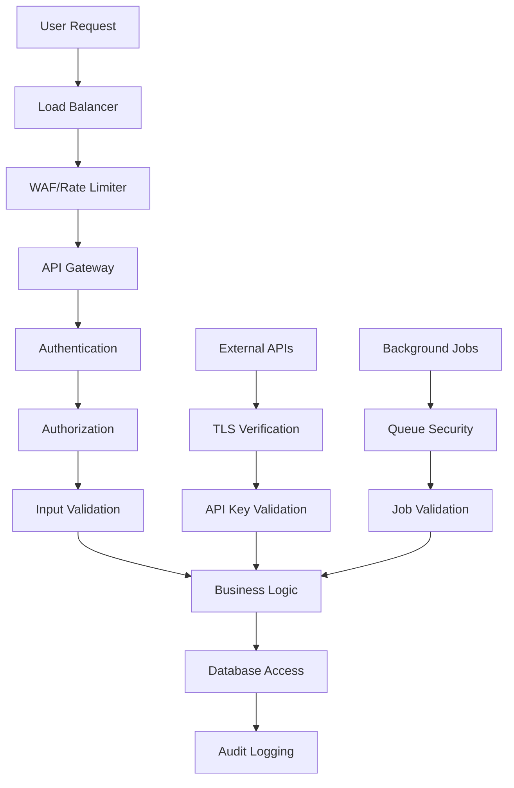

# 🔒 Security Policy

## Reporting Security Vulnerabilities

**Please do not report security vulnerabilities through public GitHub issues.**

If you discover a security vulnerability within ONYX Security Intelligence Platform, please report it to us privately. We take all security vulnerabilities seriously and will work to resolve them quickly.

### 📧 Contact Information

- **Security Team Lead**: Piyush More ([@MorePiyush55](https://github.com/MorePiyush55)) - Cybersecurity Expert
- **Development Team Lead**: Sagar Wavhal ([@Sagar4173](https://github.com/Sagar4173)) - Lead Developer
- **Infrastructure Team Lead**: Rushikesh Phalke ([@rushiphalke247](https://github.com/rushiphalke247)) - DevOps Engineer
- **Email**: Use GitHub Issues for security reports (mark as security)
- **Response Time**: We aim to acknowledge receipt within 24 hours

### 🔍 What to Include

When reporting a security vulnerability, please include:

1. **Description**: Detailed description of the vulnerability
2. **Impact**: What an attacker could achieve
3. **Steps to Reproduce**: Clear reproduction steps
4. **Environment**: Platform, version, and configuration details
5. **Proof of Concept**: If applicable, include PoC code
6. **Mitigation**: Any temporary workarounds you've identified

### 📋 Example Report

```
Subject: [SECURITY] SQL Injection in Scan Report API

Description:
The /api/reports/{scan_id} endpoint is vulnerable to SQL injection
through the scan_id parameter when using certain database configurations.

Impact:
An authenticated attacker could potentially access other users' scan
reports or extract sensitive database information.

Steps to Reproduce:
1. Authenticate to the platform
2. Send GET request to /api/reports/'; DROP TABLE users; --
3. Observe SQL error in response indicating injection point

Environment:
- Platform Version: 1.0.0
- Database: MongoDB 7.0
- Deployment: Docker Compose
- OS: Ubuntu 22.04

Proof of Concept:
curl -H "Authorization: Bearer <token>" \
  "http://localhost:8000/api/reports/test'; return this.scan_id; //"
```

---

## 🚨 Security Incident Response

### Response Timeline

| Timeframe           | Action                                              |
| ------------------- | --------------------------------------------------- |
| **Within 24 hours** | Acknowledge receipt and begin investigation         |
| **Within 72 hours** | Provide initial assessment and severity rating      |
| **Within 1 week**   | Develop and test fix (for critical vulnerabilities) |
| **Within 2 weeks**  | Release patch and security advisory                 |

### Severity Levels

#### 🔴 Critical (CVSS 9.0-10.0)

- **Response Time**: 24 hours
- **Fix Timeline**: 1-3 days
- **Examples**: Remote code execution, authentication bypass

#### 🟠 High (CVSS 7.0-8.9)

- **Response Time**: 48 hours
- **Fix Timeline**: 1 week
- **Examples**: Privilege escalation, data exposure

#### 🟡 Medium (CVSS 4.0-6.9)

- **Response Time**: 1 week
- **Fix Timeline**: 2 weeks
- **Examples**: Information disclosure, CSRF

#### 🟢 Low (CVSS 0.1-3.9)

- **Response Time**: 2 weeks
- **Fix Timeline**: Next release
- **Examples**: Minor information leaks, rate limiting bypass

---

## 🛡️ Security Features

### Current Security Measures

#### **Authentication & Authorization**

- JWT-based authentication with configurable expiration
- Secure token generation using cryptographically secure random values
- Password hashing using bcrypt with salt
- Rate limiting on authentication endpoints

#### **API Security**

- Input validation using Pydantic models
- SQL injection prevention through ODM (Beanie/Motor)
- NoSQL injection prevention through input sanitization
- CORS configuration for cross-origin protection
- Request size limits to prevent DoS attacks

#### **Data Protection**

- Environment variable-based configuration
- Secure defaults for production deployments
- Sensitive data masking in logs
- Automatic credential detection and filtering

#### **Infrastructure Security**

- Container security scanning with Trivy
- Dependency vulnerability scanning with Safety
- Secret detection with GitLeaks
- Infrastructure security auditing with Lynis

### Security Headers

The platform implements security headers for web protection:

```python
# Security headers middleware
@app.middleware("http")
async def security_headers_middleware(request: Request, call_next):
    response = await call_next(request)

    # Security headers
    response.headers["X-Content-Type-Options"] = "nosniff"
    response.headers["X-Frame-Options"] = "DENY"
    response.headers["X-XSS-Protection"] = "1; mode=block"
    response.headers["Strict-Transport-Security"] = "max-age=31536000; includeSubDomains"
    response.headers["Content-Security-Policy"] = "default-src 'self'"
    response.headers["Referrer-Policy"] = "strict-origin-when-cross-origin"

    return response
```

---

## 🔍 Security Scanning

### Self-Scanning

The platform regularly scans itself using its own security tools:

#### **Automated Security Scans**

- **Daily SAST scans** using Semgrep on codebase
- **Dependency scanning** using Safety for Python packages
- **Secret detection** using GitLeaks on commits
- **Container scanning** using Trivy on Docker images

#### **Manual Security Reviews**

- **Quarterly penetration testing** by security team
- **Code review** for all security-related changes
- **Architecture reviews** for new security features
- **Third-party security audits** annually

### Security Test Results

| Scanner  | Last Scan  | Status   | Critical | High | Medium | Low |
| -------- | ---------- | -------- | -------- | ---- | ------ | --- |
| Semgrep  | 2025-11-30 | ✅ Clean | 0        | 0    | 0      | 2   |
| Safety   | 2025-11-30 | ✅ Clean | 0        | 0    | 0      | 0   |
| GitLeaks | 2025-11-30 | ✅ Clean | 0        | 0    | 0      | 0   |
| Trivy    | 2025-11-30 | ✅ Clean | 0        | 0    | 1      | 3   |
| Bandit   | 2025-11-30 | ✅ Clean | 0        | 0    | 0      | 1   |

### AI API Security

The platform supports dual AI providers with secure API key management:

#### **OpenAI GPT-4 Security**

- API keys stored as environment variables (never in code)
- Token usage monitoring and limits
- Secure HTTPS-only communication
- Request/response logging for audit

#### **Google Gemini Security**

- Gemini API keys secured via environment variables
- Rate limiting per API key
- Secure cloud communication
- Fallback provider isolation

---

## 📊 Security Architecture

### Defense in Depth

```
┌─────────────────────────────────────────────────────────────────┐
│                        Security Layers                         │
├─────────────────────────────────────────────────────────────────┤
│  🌐 Network Layer                                              │
│  ├── Firewall Rules                                            │
│  ├── DDoS Protection                                           │
│  ├── SSL/TLS Encryption                                        │
│  └── VPN Access (Enterprise)                                   │
├─────────────────────────────────────────────────────────────────┤
│  🔐 Application Layer                                          │
│  ├── JWT Authentication                                        │
│  ├── RBAC Authorization                                        │
│  ├── Input Validation                                          │
│  ├── Rate Limiting                                             │
│  ├── Security Headers                                          │
│  └── CSRF Protection                                           │
├─────────────────────────────────────────────────────────────────┤
│  💾 Data Layer                                                 │
│  ├── Database Authentication                                   │
│  ├── Encrypted Connections                                     │
│  ├── Data Encryption at Rest                                   │
│  ├── Audit Logging                                             │
│  └── Backup Encryption                                         │
├─────────────────────────────────────────────────────────────────┤
│  🏗️ Infrastructure Layer                                       │
│  ├── Container Security                                        │
│  ├── Host Hardening                                            │
│  ├── Secrets Management                                        │
│  ├── Network Segmentation                                      │
│  └── Monitoring & Alerting                                     │
└─────────────────────────────────────────────────────────────────┘
```

### Data Flow Security



---

## 🚀 Secure Development Lifecycle

### Security in CI/CD

```yaml
# .github/workflows/security.yml
name: Security Checks

on: [push, pull_request]

jobs:
  security-scan:
    runs-on: ubuntu-latest
    steps:
      - uses: actions/checkout@v3

      - name: Run SAST Scan
        run: |
          pip install semgrep
          semgrep --config=auto --json --output=semgrep-report.json .

      - name: Run Dependency Scan
        run: |
          pip install safety
          safety check --json --output safety-report.json

      - name: Run Secret Scan
        run: |
          docker run --rm -v "$PWD:/path" zricethezav/gitleaks:latest \
            detect --source="/path" --report-format=json --report-path=/path/gitleaks-report.json

      - name: Run Container Scan
        run: |
          docker build -t app:latest .
          docker run --rm -v /var/run/docker.sock:/var/run/docker.sock \
            aquasec/trivy image --format json --output trivy-report.json app:latest

      - name: Upload Security Reports
        uses: actions/upload-artifact@v3
        with:
          name: security-reports
          path: "*-report.json"
```

### Secure Coding Guidelines

#### **Input Validation**

```python
# Good: Comprehensive input validation
from pydantic import BaseModel, validator, constr
from typing import List

class ScanRequest(BaseModel):
    repository_url: constr(regex=r'^https://github\.com/[\w\-\.]+/[\w\-\.]+\.git$')
    branch: constr(min_length=1, max_length=255)
    scan_types: List[constr(regex=r'^(sast|secrets|container|infrastructure)$')]

    @validator('repository_url')
    def validate_repository_url(cls, v):
        # Additional validation logic
        if 'localhost' in v or '127.0.0.1' in v:
            raise ValueError('Local URLs not allowed')
        return v
```

#### **SQL Injection Prevention**

```python
# Good: Using ODM with parameterized queries
async def get_scan_reports(
    project_name: Optional[str] = None,
    status: Optional[ScanStatus] = None
) -> List[ScanReport]:
    query = {}

    if project_name:
        # Safe: Using ODM field matching
        query['project_name'] = {"$regex": f"^{re.escape(project_name)}"}

    if status:
        query['status'] = status

    return await ScanReport.find(query).to_list()

# Bad: String concatenation (vulnerable to NoSQL injection)
# query_string = f"{{\"project_name\": \"{project_name}\"}}"
```

#### **Authentication Security**

```python
# Good: Secure JWT implementation
import jwt
from datetime import datetime, timedelta
from typing import Optional

class AuthService:
    def create_access_token(self, user_id: str) -> str:
        payload = {
            "sub": user_id,
            "iat": datetime.utcnow(),
            "exp": datetime.utcnow() + timedelta(minutes=30),
            "type": "access"
        }
        return jwt.encode(payload, settings.secret_key, algorithm="HS256")

    def verify_token(self, token: str) -> Optional[str]:
        try:
            payload = jwt.decode(
                token,
                settings.secret_key,
                algorithms=["HS256"],
                options={"verify_exp": True}
            )
            return payload.get("sub")
        except jwt.ExpiredSignatureError:
            raise HTTPException(401, "Token has expired")
        except jwt.InvalidTokenError:
            raise HTTPException(401, "Invalid token")
```

---

## 🔧 Security Configuration

### Production Security Settings

```python
# config.py - Production security configuration
class ProductionConfig(BaseConfig):
    # Authentication
    SECRET_KEY: str = Field(..., min_length=32)
    ACCESS_TOKEN_EXPIRE_MINUTES: int = 30
    REFRESH_TOKEN_EXPIRE_DAYS: int = 7

    # Security
    FORCE_HTTPS: bool = True
    SECURE_COOKIES: bool = True
    SESSION_COOKIE_HTTPONLY: bool = True
    SESSION_COOKIE_SECURE: bool = True
    SESSION_COOKIE_SAMESITE: str = "strict"

    # Rate Limiting
    RATE_LIMIT_PER_MINUTE: int = 60
    RATE_LIMIT_BURST: int = 10

    # Database Security
    MONGODB_TLS: bool = True
    MONGODB_AUTH_SOURCE: str = "admin"

    # API Security
    MAX_REQUEST_SIZE: int = 10 * 1024 * 1024  # 10MB
    CORS_ORIGINS: List[str] = []  # Restrict origins in production

    # Logging Security
    LOG_LEVEL: str = "WARNING"  # Reduce log verbosity
    MASK_SENSITIVE_DATA: bool = True
```

### Environment Security Checklist

#### **Deployment Checklist**

- [ ] **Secrets Management**: All secrets in environment variables or vault
- [ ] **HTTPS Only**: Force HTTPS in production
- [ ] **Database Security**: Authentication and encryption enabled
- [ ] **Firewall Rules**: Only necessary ports open
- [ ] **Regular Updates**: OS and dependencies updated
- [ ] **Monitoring**: Security monitoring and alerting enabled
- [ ] **Backup Security**: Encrypted backups with access controls
- [ ] **Audit Logging**: Comprehensive audit trail enabled

#### **Code Security Checklist**

- [ ] **Input Validation**: All inputs validated and sanitized
- [ ] **Output Encoding**: Proper encoding for XSS prevention
- [ ] **Authentication**: Strong authentication mechanisms
- [ ] **Authorization**: Proper access controls implemented
- [ ] **Error Handling**: No sensitive information in error messages
- [ ] **Logging**: No sensitive data logged
- [ ] **Dependencies**: All dependencies security scanned
- [ ] **Secrets**: No hardcoded secrets in code

---

## 📞 Security Contact & Support

### Security Team

- **Security Lead**: security-lead@onyx-security.ai
- **DevSecOps Engineer**: devsecops@onyx-security.ai
- **Platform Security**: platform-security@onyx-security.ai

### Incident Response Team

24/7 incident response for critical security issues:

- **Phone**: +1-XXX-XXX-XXXX (US)
- **Phone**: +44-XXX-XXX-XXXX (EU)
- **Slack**: #security-incidents (for verified contributors)

### Security Resources

- **Security Documentation**: [docs/security/](security/)
- **Security Advisories**: [GitHub Security Advisories](https://github.com/Sagar4173/ONYX/security/advisories)
- **CVE Database**: [MITRE CVE](https://cve.mitre.org/)
- **OWASP Resources**: [OWASP Top 10](https://owasp.org/www-project-top-ten/)

---

## 🏆 Security Hall of Fame

We acknowledge security researchers who have responsibly disclosed vulnerabilities:

| Researcher              | Vulnerability | Severity | Date | Bounty |
| ----------------------- | ------------- | -------- | ---- | ------ |
| _Awaiting first report_ | -             | -        | -    | -      |

### Bug Bounty Program

We offer recognition and rewards for security vulnerability reports:

- **Critical**: $500 - $2000
- **High**: $200 - $500
- **Medium**: $50 - $200
- **Low**: Recognition + Swag

_Bounty amounts depend on impact, quality of report, and fix complexity._

---

## 📋 Compliance & Standards

### Security Standards Compliance

- **ISO 27001**: Information Security Management
- **SOC 2 Type II**: Security, Availability, Confidentiality
- **NIST Cybersecurity Framework**: Comprehensive security controls
- **OWASP ASVS**: Application Security Verification Standard

### Privacy & Data Protection

- **GDPR**: General Data Protection Regulation compliance
- **CCPA**: California Consumer Privacy Act compliance
- **PIPEDA**: Personal Information Protection (Canada)
- **Data Minimization**: Collect only necessary data
- **Right to Erasure**: User data deletion capabilities

---

## 📝 Security Updates

### Version Security Notes

#### **v1.0.0** (Current)

- ✅ Initial security implementation
- ✅ Basic authentication and authorization
- ✅ Input validation and sanitization
- ✅ Security headers implementation
- ⚠️ Limited to single-tenant deployment

#### **v1.1.0** (Planned)

- 🔄 Enhanced authentication with MFA
- 🔄 Role-based access control (RBAC)
- 🔄 API rate limiting improvements
- 🔄 Security audit logging

#### **v1.2.0** (Planned)

- 🔄 Multi-tenant security isolation
- 🔄 Advanced threat detection
- 🔄 Security incident response automation
- 🔄 Compliance reporting enhancements

---

## 👥 Security Team

**ONYX Platform Security** is overseen by our dedicated team:

- **🔒 Piyush More** ([@MorePiyush55](https://github.com/MorePiyush55)) - Security Expert & Vulnerability Assessment Lead
- **🧑‍💻 Sagar Wavhal** ([@Sagar4173](https://github.com/Sagar4173)) - Lead Developer & Security Implementation
- **⚙️ Rushikesh Phalke** ([@RushiPhalke247](https://github.com/RushiPhalke247)) - DevOps Engineer & Infrastructure Security

Thank you for helping keep ONYX Platform secure! 🔒

**Remember**: Security is everyone's responsibility. If you see something, say something.
