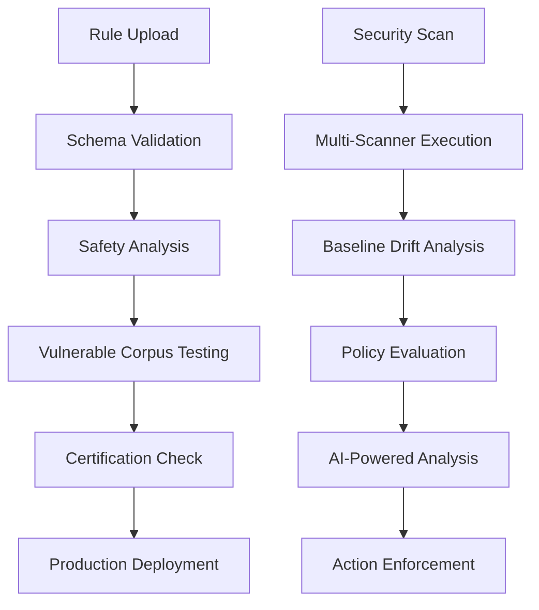

# 🔱 God-Level Security Features Documentation

## Overview

This document describes the comprehensive "god-level" security enhancements implemented in the ONYX Platform. These enterprise-grade features transform the platform into a production-ready security powerhouse with advanced rule management, testing, baseline tracking, and policy enforcement capabilities.

## 🚀 God-Level Features

### 1. Rule Parsing Layer with Strict Schema Validation

**Location**: `backend/services/rule_parsing_engine.py`

**Capabilities**:

- **JSON Schema Validation**: Strict schema enforcement for all custom rule uploads
- **Regex Safety Analysis**: Detects catastrophic backtracking patterns and dangerous regex constructs
- **Performance Thresholds**: Enforces execution time limits and complexity bounds
- **Rule Provenance Tracking**: Complete metadata tracking including author, source repo, commit hash
- **Safety Scoring**: Automated risk assessment for custom rules

**Key Features**:

```python
# Example validation result
{
    "is_valid": true,
    "rule_id": "custom-rule-abc123",
    "safety_score": 95,
    "performance_risk": "low",
    "provenance": {
        "author": "security-team",
        "source_repo": "security-rules-repo",
        "commit_hash": "def456"
    }
}
```

**Usage**:

```bash
POST /api/v1/god-level/rule/upload
{
    "rule_content": "...",
    "rule_type": "semgrep",
    "metadata": {
        "author": "security-team",
        "source_repo": "rules-repo"
    }
}
```

### 2. Rule Testing Framework with Vulnerable Corpus

**Location**: `backend/services/rule_testing_framework.py`

**Capabilities**:

- **Mandatory Dry-Run Testing**: Every rule must pass tests against known vulnerable repositories
- **Vulnerable Repository Corpus**: Includes OWASP WebGoat, DVWA, TruffleHog test keys
- **Precision/Recall Requirements**: 95% precision and 90% recall thresholds
- **Automated Certification**: Rules must be certified before production deployment
- **Performance Benchmarking**: Execution time and resource usage tracking

**Test Repositories**:

- OWASP WebGoat (Java vulnerabilities)
- Damn Vulnerable Web Application (PHP/Web vulnerabilities)
- TruffleHog Test Keys (Secret detection)
- Custom vulnerable code samples

**Certification Process**:

1. Rule validation via parsing engine
2. Execution against vulnerable corpus
3. Precision/recall calculation
4. Performance impact assessment
5. Certification approval/rejection

### 3. Advanced Baseline Management with Drift Detection

**Location**: `backend/services/baseline_manager.py`

**Capabilities**:

- **Fingerprint-Based Tracking**: Unique fingerprints for each security finding
- **Drift Detection Algorithms**: Sophisticated change detection and categorization
- **Automatic Actions**: Auto-close resolved issues, flag regressions
- **Security Score Calculation**: Trending security health metrics
- **Baseline Storage**: SQLite database with complete finding history

**Drift Categories**:

- **New Vulnerabilities**: Previously unseen security issues
- **Resolved Issues**: Fixed vulnerabilities from baseline
- **Modified Findings**: Changed severity or location
- **Persistent Issues**: Ongoing unresolved vulnerabilities

**Example Drift Analysis**:

```python
{
    "drift_detected": true,
    "new_vulnerabilities": 3,
    "resolved_vulnerabilities": 2,
    "security_score_trend": {
        "current": 78,
        "previous": 71,
        "change": "+7"
    },
    "automatic_actions": [
        "auto_closed_resolved_issues",
        "flagged_security_regression"
    ]
}
```

### 4. Policy-as-Code Enforcement Engine

**Location**: `backend/services/policy_as_code_engine.py`

**Capabilities**:

- **Git-Based Policy Storage**: Policies stored as code in Git repositories
- **Policy Change Requests**: PR-style workflow for policy modifications
- **Enforcement Modes**: enforce/warn/canary/disabled modes
- **Violation Tracking**: Complete audit trail of policy violations
- **Automatic Actions**: Block merges, require approvals, send notifications

**Enforcement Modes**:

- `enforce`: Block merges on violation
- `warn`: Allow merge with warnings
- `canary`: Test mode, collect data only
- `disabled`: Policy disabled

**Policy Types**:

- Vulnerability thresholds
- Compliance requirements
- Code quality gates
- Secret detection rules
- Dependency policies
- Custom security rules

### 5. God-Level Integration Route

**Location**: `backend/routes/god_level_security.py`

**Endpoints**:

- `POST /api/v1/god-level/rule/upload` - Advanced rule upload with validation
- `POST /api/v1/god-level/scan/advanced` - Comprehensive security scanning
- `GET /api/v1/god-level/baseline/status` - Baseline drift analysis
- `POST /api/v1/god-level/policy/evaluate` - Policy compliance evaluation
- `GET /api/v1/god-level/analytics/dashboard` - God-level analytics

## 🔧 Implementation Architecture

### Database Schema

**Rules Storage**:

```sql
CREATE TABLE custom_rules (
    rule_id TEXT PRIMARY KEY,
    rule_content TEXT NOT NULL,
    rule_type TEXT NOT NULL,
    validation_status TEXT,
    safety_score INTEGER,
    created_at TEXT,
    author TEXT,
    source_repo TEXT,
    commit_hash TEXT
);
```

**Baseline Storage**:

```sql
CREATE TABLE security_baselines (
    baseline_id TEXT PRIMARY KEY,
    repository TEXT NOT NULL,
    branch TEXT NOT NULL,
    findings_snapshot TEXT,
    security_score INTEGER,
    created_at TEXT
);
```

**Policy Storage**:

```sql
CREATE TABLE security_policies (
    policy_id TEXT PRIMARY KEY,
    name TEXT NOT NULL,
    enforcement_mode TEXT,
    rules TEXT,
    status TEXT,
    git_commit_hash TEXT
);
```

### Security Workflow



## 📊 Testing and Validation

### Test Suite

**Location**: `scripts/test_god_level_security.py`

**Test Categories**:

1. Rule Parsing Engine validation
2. Rule Testing Framework certification
3. Baseline Manager drift detection
4. Policy Engine enforcement
5. End-to-end integration workflow

**Running Tests**:

```bash
cd scripts
python test_god_level_security.py
```

### Expected Outputs

The test suite validates:

- ✅ Strict schema validation working
- ✅ Regex safety analysis functional
- ✅ Vulnerable corpus testing operational
- ✅ Precision/recall requirements enforced
- ✅ Drift detection algorithms working
- ✅ Policy enforcement operational
- ✅ Git-based governance functional

## 🔐 Security Features Summary

### Enterprise-Grade Validation

- JSON Schema enforcement
- Regex catastrophic backtracking detection
- Performance impact analysis
- Rule provenance tracking

### Production-Ready Testing

- Mandatory vulnerable corpus validation
- Automated precision/recall calculation
- Performance benchmarking
- Certification pipeline

### Intelligent Baseline Management

- Fingerprint-based change tracking
- Sophisticated drift detection
- Automatic remediation actions
- Security trend analysis

### Policy-Driven Enforcement

- Git-based policy storage
- PR-style policy changes
- Multiple enforcement modes
- Complete violation audit trail

## 🚀 Deployment and Usage

### Quick Start

1. **Install Dependencies**:

```bash
pip install -r requirements.txt
```

2. **Initialize God-Level Components**:

```python
from services.rule_parsing_engine import RuleParsingEngine
from services.rule_testing_framework import RuleTestingFramework
from services.baseline_manager import BaselineManager
from services.policy_as_code_engine import PolicyAsCodeEngine

# Initialize all components
rule_parser = RuleParsingEngine()
rule_tester = RuleTestingFramework()
baseline_manager = BaselineManager()
policy_engine = PolicyAsCodeEngine()
```

3. **Upload and Test Custom Rule**:

```bash
curl -X POST http://localhost:8000/api/v1/god-level/rule/upload \
  -H "Content-Type: application/json" \
  -d '{
    "rule_content": "...",
    "rule_type": "semgrep",
    "metadata": {
      "author": "security-team"
    }
  }'
```

4. **Run Advanced Security Scan**:

```bash
curl -X POST http://localhost:8000/api/v1/god-level/scan/advanced \
  -H "Content-Type: application/json" \
  -d '{
    "repository": "my-critical-app",
    "branch": "main",
    "commit_hash": "abc123"
  }'
```

### Configuration

**Environment Variables**:

```bash
# God-level features configuration
GOD_LEVEL_ENABLED=true
RULE_VALIDATION_STRICT=true
VULNERABLE_CORPUS_PATH=/path/to/vulnerable/repos
POLICY_REPO_PATH=/path/to/policy/repo
BASELINE_STORAGE_PATH=/path/to/baselines
```

## 📈 Monitoring and Analytics

### Key Metrics

- **Rule Quality**: Safety scores, certification rates
- **Baseline Health**: Drift frequency, resolution rates
- **Policy Compliance**: Violation rates, enforcement effectiveness
- **System Performance**: Processing times, resource usage

### Analytics Dashboard

Access comprehensive analytics at:

```
GET /api/v1/god-level/analytics/dashboard
```

Returns:

- Rule validation statistics
- Testing framework metrics
- Baseline drift analytics
- Policy enforcement data

## 🎯 Production Considerations

### Performance

- Asynchronous processing for all operations
- Database indexing for fast lookups
- Caching for frequently accessed data
- Resource limits for rule execution

### Scalability

- Horizontal scaling support
- Queue-based processing
- Database partitioning by repository
- API rate limiting

### Security

- Input validation and sanitization
- Secure rule execution sandboxing
- Audit logging for all operations
- Role-based access control

### Monitoring

- Health check endpoints
- Performance metrics collection
- Error tracking and alerting
- Compliance reporting

## 🔮 Future Enhancements

### Planned Features

- Machine learning for rule optimization
- Advanced threat intelligence integration
- Real-time vulnerability feeds
- Enhanced compliance frameworks
- Custom dashboard builders

### Roadmap

- Q1: ML-powered rule suggestions
- Q2: Advanced threat correlation
- Q3: Enhanced compliance reporting
- Q4: Custom policy templates

---

## 🎉 Conclusion

The God-Level Security Features transform the ONYX Security Intelligence Platform into an enterprise-ready security powerhouse. With strict validation, mandatory testing, intelligent baselines, and policy-driven enforcement, organizations can achieve unprecedented security posture visibility and control.

These features represent the pinnacle of security engineering, combining automated validation, intelligent analysis, and policy-driven enforcement to create a truly enterprise-grade security platform.

**🔱 Welcome to God-Level Security! 🔱**
